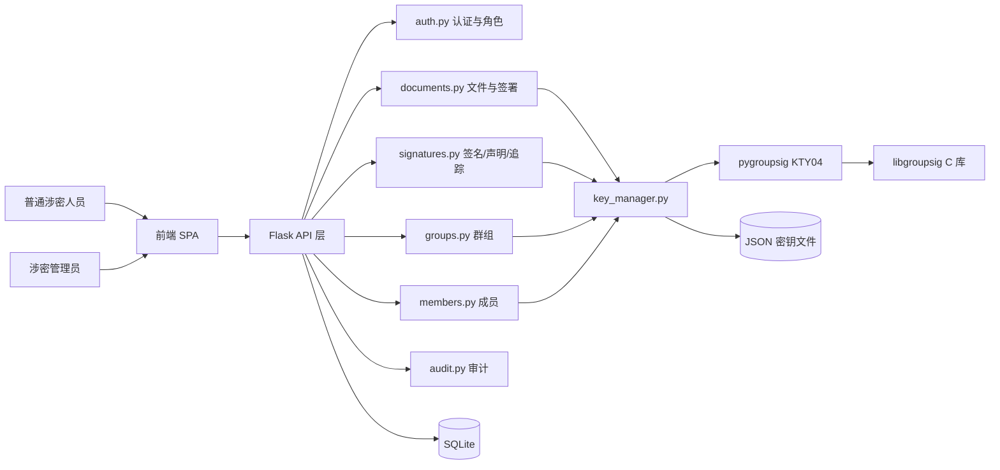
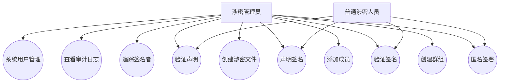
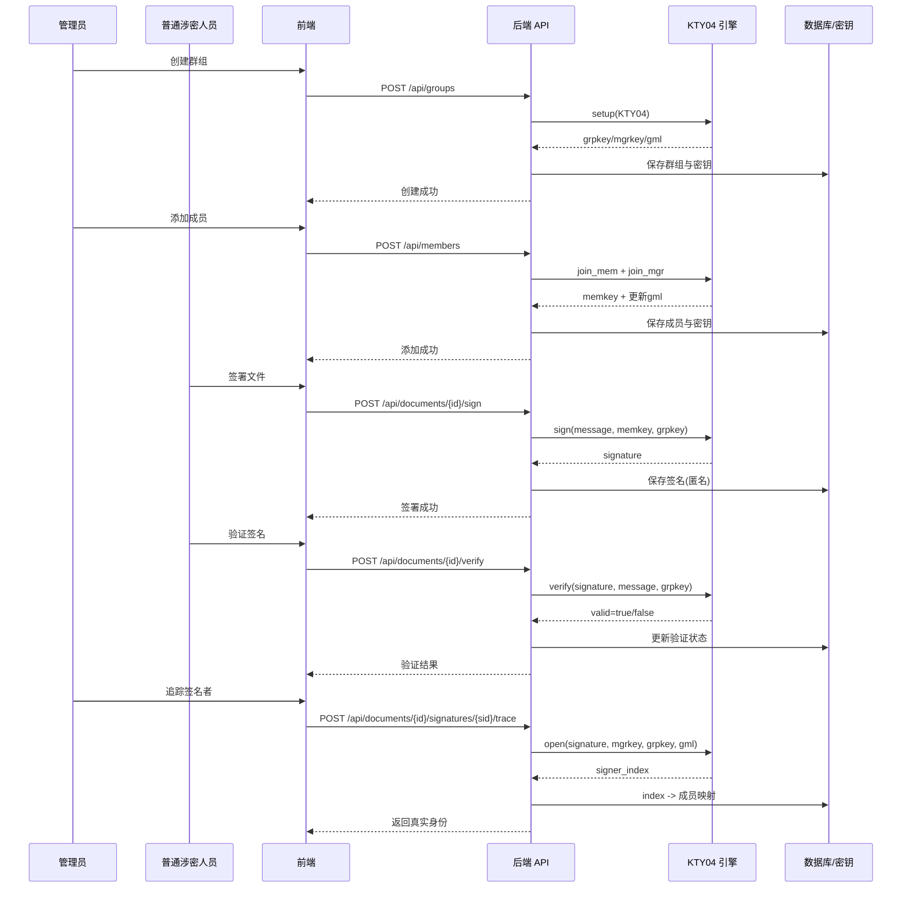
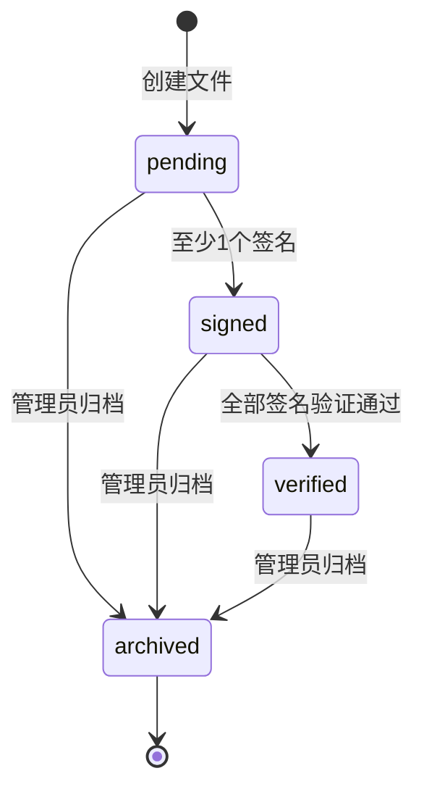
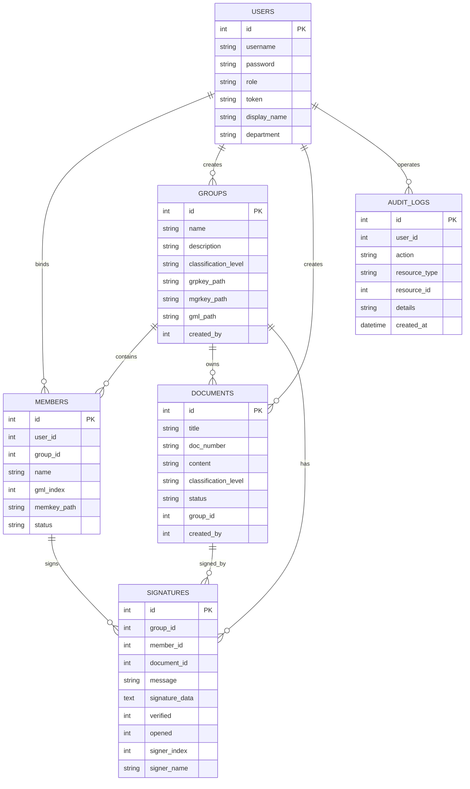

# 论文配图（Mermaid）

以下图可直接粘贴到支持 Mermaid 的编辑器或论文附录中。

## 1. 系统总体架构图

```mermaid
flowchart LR
    U1[普通涉密人员] --> FE[前端 SPA]
    U2[涉密管理员] --> FE

    FE --> API[Flask API 层]

    API --> AUTH[auth.py 认证与角色]
    API --> DOC[documents.py 文件与签署]
    API --> SIG[signatures.py 签名/声明/追踪]
    API --> GRP[groups.py 群组]
    API --> MEM[members.py 成员]
    API --> AUD[audit.py 审计]

    DOC --> KM[key_manager.py]
    SIG --> KM
    GRP --> KM
    MEM --> KM

    KM --> PYG[pygroupsig KTY04]
    PYG --> LIB[libgroupsig C 库]

    API --> DB[(SQLite)]
    KM --> KEY[(JSON 密钥文件)]
```

## 2. 角色用例图

```mermaid
flowchart TB
    Admin[涉密管理员]
    User[普通涉密人员]

    UC1((创建群组))
    UC2((添加成员))
    UC3((创建涉密文件))
    UC4((匿名签署))
    UC5((验证签名))
    UC6((声明签名))
    UC7((验证声明))
    UC8((追踪签名者))
    UC9((查看审计日志))
    UC10((系统用户管理))

    Admin --> UC1
    Admin --> UC2
    Admin --> UC3
    Admin --> UC4
    Admin --> UC5
    Admin --> UC6
    Admin --> UC7
    Admin --> UC8
    Admin --> UC9
    Admin --> UC10

    User --> UC4
    User --> UC5
    User --> UC6
    User --> UC7
```

## 3. 文件签署与追踪时序图

```mermaid
sequenceDiagram
    participant A as 管理员
    participant U as 普通涉密人员
    participant F as 前端
    participant B as 后端 API
    participant K as KTY04 引擎
    participant D as 数据库/密钥

    A->>F: 创建群组
    F->>B: POST /api/groups
    B->>K: setup(KTY04)
    K-->>B: grpkey/mgrkey/gml
    B->>D: 保存群组与密钥
    B-->>F: 创建成功

    A->>F: 添加成员
    F->>B: POST /api/members
    B->>K: join_mem + join_mgr
    K-->>B: memkey + 更新gml
    B->>D: 保存成员与密钥
    B-->>F: 添加成功

    U->>F: 签署文件
    F->>B: POST /api/documents/{id}/sign
    B->>K: sign(message, memkey, grpkey)
    K-->>B: signature
    B->>D: 保存签名(匿名)
    B-->>F: 签署成功

    U->>F: 验证签名
    F->>B: POST /api/documents/{id}/verify
    B->>K: verify(signature, message, grpkey)
    K-->>B: valid=true/false
    B->>D: 更新验证状态
    B-->>F: 验证结果

    A->>F: 追踪签名者
    F->>B: POST /api/documents/{id}/signatures/{sid}/trace
    B->>K: open(signature, mgrkey, grpkey, gml)
    K-->>B: signer_index
    B->>D: index -> 成员映射
    B-->>F: 返回真实身份
```

## 4. 文件状态机图

```mermaid
stateDiagram-v2
    [*] --> pending: 创建文件
    pending --> signed: 至少1个签名
    signed --> verified: 全部签名验证通过
    pending --> archived: 管理员归档
    signed --> archived: 管理员归档
    verified --> archived: 管理员归档
    archived --> [*]
```

## 5. 数据库 ER 图

```mermaid
erDiagram
    USERS ||--o{ MEMBERS : binds
    USERS ||--o{ GROUPS : creates
    USERS ||--o{ DOCUMENTS : creates
    USERS ||--o{ AUDIT_LOGS : operates

    GROUPS ||--o{ MEMBERS : contains
    GROUPS ||--o{ DOCUMENTS : owns
    GROUPS ||--o{ SIGNATURES : has

    MEMBERS ||--o{ SIGNATURES : signs
    DOCUMENTS ||--o{ SIGNATURES : signed_by

    USERS {
        int id PK
        string username
        string password
        string role
        string token
        string display_name
        string department
    }

    GROUPS {
        int id PK
        string name
        string description
        string classification_level
        string grpkey_path
        string mgrkey_path
        string gml_path
        int created_by
    }

    MEMBERS {
        int id PK
        int user_id
        int group_id
        string name
        int gml_index
        string memkey_path
        string status
    }

    DOCUMENTS {
        int id PK
        string title
        string doc_number
        string content
        string classification_level
        string status
        int group_id
        int created_by
    }

    SIGNATURES {
        int id PK
        int group_id
        int member_id
        int document_id
        string message
        text signature_data
        int verified
        int opened
        int signer_index
        string signer_name
    }

    AUDIT_LOGS {
        int id PK
        int user_id
        string action
        string resource_type
        int resource_id
        string details
        datetime created_at
    }
```
